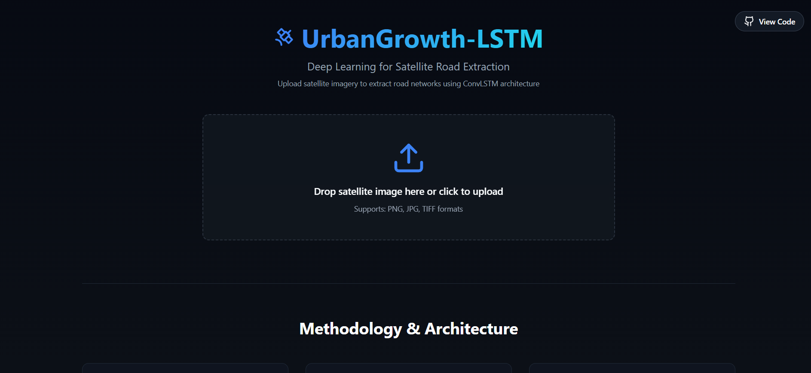
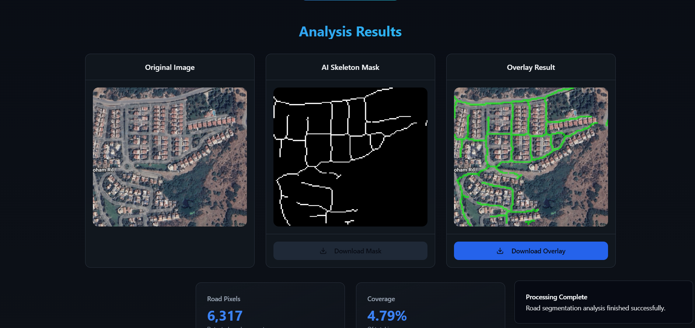

# UrbanGrowth-LSTM: Satellite Road Extraction 🛰️


A full-stack deep learning application that automatically segments and extracts road networks from satellite imagery using a custom **Coordinate-Aware ConvLSTM-UNet** architecture.

> **🚀 Live Demo:** [https://urban-growth-lstm.vercel.app/](https://urban-growth-lstm.vercel.app/)  
> *(Note: The backend runs on a free cloud instance. The first request may take ~40s to wake up the server.)*

---

## 📸 Project Demo

### 1. Interactive Dashboard
The interface allows users to easily drag and drop satellite imagery for instant analysis.



### 2. Segmentation Results
The model outputs a binary mask and a visual overlay, highlighting detected road networks with high precision.



---

## 🌟 Key Features

* **Advanced Deep Learning:** Uses a **ConvLSTM-UNet** with **Coordinate Attention** channels to capture global spatial dependencies and maintain road connectivity.
* **Full-Stack Architecture:** * **Frontend:** Modern, responsive UI built with **React**, **TypeScript**, and **Tailwind CSS**.
    * **Backend:** High-performance REST API built with **FastAPI** and **OpenCV**.
* **Real-time Inference:** optimized model serving via **Docker** containers.
* **Post-Processing Pipeline:** Custom morphological operations and skeletonization to produce GIS-ready road maps.
* **Cloud Deployment:** Fully automated CI/CD pipeline deploying to **Vercel** (Frontend) and **Hugging Face Spaces** (Backend).

---

## 🏗️ Technical Architecture

This project is structured as a Monorepo:

* **`/frontend`**: React application using Vite and Shadcn UI.
* **`/backend`**: Python server handling model inference and image processing.

### Tech Stack
| Component | Technologies |
|-----------|--------------|
| **Frontend** | React 18, TypeScript, Tailwind CSS, Lucide Icons, Vite |
| **Backend** | Python 3.10, FastAPI, Uvicorn, NumPy |
| **AI/ML** | TensorFlow/Keras, OpenCV, Scikit-Image |
| **DevOps** | Docker, Git, Vercel, Hugging Face Spaces |

---

## 🚀 Getting Started Locally

If you want to run the full stack on your own machine:

### Prerequisites
* Node.js & npm
* Python 3.10+
* Git

### 1. Backend Setup (The Brain)
⚠️ **Note:** The deep learning model is large. You must download the weights separately.
1.  **[Download the model weights (`best_convlstm_unet.h5`) here](#)** *(Replace this with your Google Drive Link)*.
2.  Place the file inside the `/backend` folder.

```bash
cd backend
pip install -r requirements.txt
python -m uvicorn main:app --reload
# Server will start on [http://127.0.0.1:8000](http://127.0.0.1:8000)


2. Frontend Setup (The Interface)
Open a new terminal:

Bash

cd frontend
npm install
npm run dev
# Dashboard will open on http://localhost:5173


This is the final touch! A professional README.md with screenshots is what distinguishes a "coding exercise" from a "software product."

Here is a complete, polished template. I have added placeholders for your screenshots.

Step 1: Take Your Screenshots
Before you edit the file, go to your live website and take two screenshots:

dashboard.png: A screenshot of the whole page (Hero section + Upload area).

results.png: A screenshot of the Green Results grid (Original vs Mask vs Overlay) after processing an image.

Step 2: Upload Screenshots to GitHub
Go to your GitHub repo.

Click Add file -> Upload files.

Drag your two screenshots there.

Commit them. (GitHub will save them in the root folder, which is fine).

Step 3: Update README.md
Copy the code below and paste it into your root README.md.

Markdown

# UrbanGrowth-LSTM: Satellite Road Extraction 🛰️


A full-stack deep learning application that automatically segments and extracts road networks from satellite imagery using a custom **Coordinate-Aware ConvLSTM-UNet** architecture.

> **🚀 Live Demo:** [https://urban-growth-lstm.vercel.app/](https://urban-growth-lstm.vercel.app/)  
> *(Note: The backend runs on a free cloud instance. The first request may take ~40s to wake up the server.)*

---

## 📸 Project Demo

### 1. Interactive Dashboard
The interface allows users to easily drag and drop satellite imagery for instant analysis.


### 2. Segmentation Results
The model outputs a binary mask and a visual overlay, highlighting detected road networks with high precision.


---

## 🌟 Key Features

* **Advanced Deep Learning:** Uses a **ConvLSTM-UNet** with **Coordinate Attention** channels to capture global spatial dependencies and maintain road connectivity.
* **Full-Stack Architecture:** * **Frontend:** Modern, responsive UI built with **React**, **TypeScript**, and **Tailwind CSS**.
    * **Backend:** High-performance REST API built with **FastAPI** and **OpenCV**.
* **Real-time Inference:** optimized model serving via **Docker** containers.
* **Post-Processing Pipeline:** Custom morphological operations and skeletonization to produce GIS-ready road maps.
* **Cloud Deployment:** Fully automated CI/CD pipeline deploying to **Vercel** (Frontend) and **Hugging Face Spaces** (Backend).

---

## 🏗️ Technical Architecture

This project is structured as a Monorepo:

* **`/frontend`**: React application using Vite and Shadcn UI.
* **`/backend`**: Python server handling model inference and image processing.

### Tech Stack
| Component | Technologies |
|-----------|--------------|
| **Frontend** | React 18, TypeScript, Tailwind CSS, Lucide Icons, Vite |
| **Backend** | Python 3.10, FastAPI, Uvicorn, NumPy |
| **AI/ML** | TensorFlow/Keras, OpenCV, Scikit-Image |
| **DevOps** | Docker, Git, Vercel, Hugging Face Spaces |

---

## 🚀 Getting Started Locally

If you want to run the full stack on your own machine:

### Prerequisites
* Node.js & npm
* Python 3.10+
* Git

### 1. Backend Setup (The Brain)
⚠️ **Note:** The deep learning model is large. You must download the weights separately.
1.  **[Download the model weights (`best_convlstm_unet.h5`) here](#)** *(Replace this with your Google Drive Link)*.
2.  Place the file inside the `/backend` folder.

```bash
cd backend
pip install -r requirements.txt
python -m uvicorn main:app --reload
# Server will start on [http://127.0.0.1:8000](http://127.0.0.1:8000)
2. Frontend Setup (The Interface)
Open a new terminal:

Bash

cd frontend
npm install
npm run dev
# Dashboard will open on http://localhost:5173
🧠 Model Performance
The underlying model addresses the common issue of "broken roads" in standard UNet segmentations.

Architecture: Hybrid Loss (Dice + BCE) with Coordinate Conv layers.

Dataset: Trained on the DeepGlobe Road Extraction dataset.

Metrics: Achieved an F1-Score of ~0.65 and Dice Coefficient of 0.61.

👤 Author
Soham Barot Full Stack Developer & AI Enthusiast

GitHub Profile | LinkedIn (Add your LinkedIn link here)
